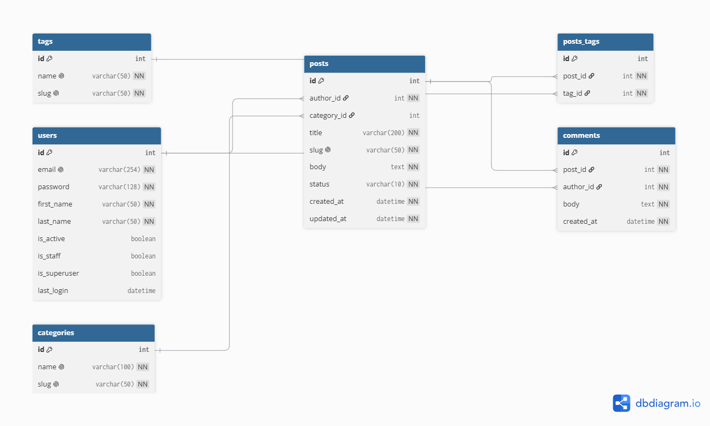

# Blog API

REST API for a blog built with Django and Django REST Framework.

## Stack

- Python 3.11+
- Django 5, Django REST Framework
- python-decouple for configuration
- SQLite (local), PostgreSQL (prod)

## Project structure

- `apps/auths` — custom user model (email login)
- `apps/blog` — categories, tags, posts, comments
- `settings/` — project package and configuration (`conf.py`, `base.py`, `env/local.py`, `env/prod.py`)
- `requirements/` — split dependencies (`base`, `dev`, `prod`)

## ERD



## Setup

```bash
git clone https://github.com/<your-username>/blog-api.git
cd blog-api
python -m venv venv
source venv/bin/activate
pip install -r requirements/dev.txt
```

Create `settings/.env`:

```
BLOG_ENV_ID=local
BLOG_SECRET_KEY=your-secret-key
```

## Run

```bash
python manage.py migrate
python manage.py createsuperuser
python manage.py runserver
```

Admin panel: http://127.0.0.1:8000/admin/

## Environments

`BLOG_ENV_ID` in `settings/.env` selects the settings module:

- `local` → `settings.env.local` (DEBUG on, SQLite)
- `prod` → `settings.env.prod` (DEBUG off, PostgreSQL)

## Lint

```bash
ruff check .
```